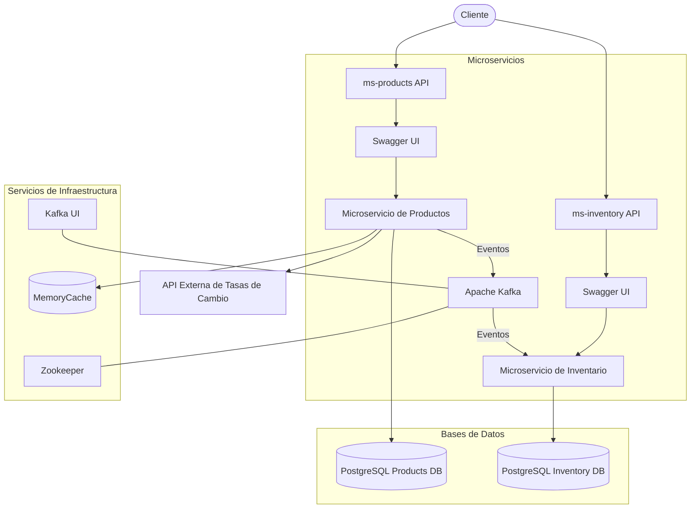
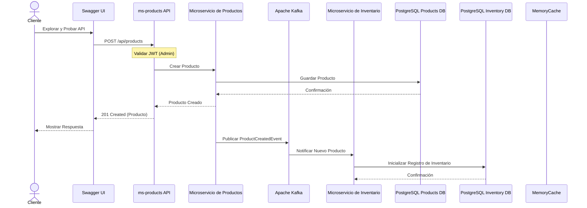
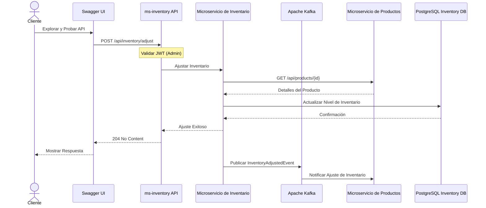

# Sistema de Inventario y Productos - Arquitectura de Microservicios

Este proyecto implementa un sistema de gestión de inventario y productos utilizando una arquitectura de microservicios en .NET. El sistema está compuesto por dos microservicios principales (`ms-products` y `ms-inventory`) que interactúan entre sí mediante un patrón de comunicación basada en eventos usando Apache Kafka.

## Descripción de la Solución

### Arquitectura General

El sistema utiliza una arquitectura basada en microservicios con las siguientes características:

- **Desacoplamiento**: Los microservicios son independientes y pueden ser desplegados, actualizados y escalados individualmente.
- **Comunicación Asíncrona**: Los servicios se comunican principalmente a través de eventos para garantizar la escalabilidad y resiliencia.
- **Base de Datos por Servicio**: Cada microservicio tiene su propia base de datos PostgreSQL para asegurar el aislamiento de datos.
- **Comunicación Basada en Eventos**: Se utiliza Apache Kafka para la comunicación asíncrona entre servicios.
- **Caché en Memoria**: Se utiliza MemoryCache para almacenar información temporal, como tasas de cambio de monedas.
- **Documentación de API**: Cada microservicio expone su documentación a través de Swagger UI.

### Microservicios Implementados

1. **Microservicio de Productos (ms-products)**:
   - Gestiona el catálogo de productos
   - Permite crear, actualizar, eliminar y consultar productos
   - Maneja el historial de precios de los productos
   - Emite eventos cuando se crean o actualizan productos
   - Proporciona conversión de moneda usando un servicio externo con cacheo
   - Implementa autenticación y autorización basada en JWT
   - Utiliza PostgreSQL como base de datos
   - Expone documentación interactiva a través de Swagger UI

2. **Microservicio de Inventario (ms-inventory)**:
   - Gestiona los niveles de inventario de los productos
   - Permite realizar ajustes de inventario (incrementos, decrementos)
   - Proporciona información sobre la disponibilidad de los productos
   - Consume eventos de productos para mantener la consistencia
   - Implementa autenticación y autorización basada en JWT
   - Utiliza PostgreSQL como base de datos
   - Expone documentación interactiva a través de Swagger UI

### Integración y Comunicación entre Microservicios

La comunicación entre los microservicios se realiza principalmente a través de:

1. **Eventos en Kafka**: Los servicios publican y consumen eventos para mantener la coherencia eventual
   - **ProductCreatedEvent**: Emitido cuando se crea un nuevo producto
   - **ProductUpdatedEvent**: Emitido cuando se actualiza un producto
   - **InventoryAdjustedEvent**: Emitido cuando se ajusta el nivel de inventario

2. **API REST**: Para comunicación síncrona cuando sea necesario
   - Consultas en tiempo real entre microservicios
   - Operaciones que requieren respuesta inmediata

## Diagrama de Arquitectura



## Flujo de Datos para Operaciones Clave

### Crear un Nuevo Producto



### Ajustar Inventario



## Consideraciones de Diseño e Implementación

### Patrones y Tecnologías Utilizadas

1. **Patrón CQRS**:
   - Separación de comandos (operaciones de escritura) y consultas (operaciones de lectura)
   - Utilización de MediatR para implementar los handlers de comandos y consultas
   - Mejora de la escalabilidad y mantenibilidad del código

2. **Patrón Repository**:
   - Abstracción de acceso a datos
   - Facilita las pruebas unitarias al permitir el mocking de los repositorios
   - Centralización de la lógica de acceso a datos

3. **Event Sourcing**:
   - Seguimiento de cambios a través de eventos
   - Utilizado para el historial de precios en el microservicio de productos
   - Permite reconstruir el estado del sistema en cualquier momento

4. **Docker y Docker Compose**:
   - Containerización de los microservicios
   - Facilita el despliegue y la escalabilidad
   - Asegura consistencia entre entornos de desarrollo, pruebas y producción

5. **Apache Kafka**:
   - Message broker para comunicación asíncrona entre servicios
   - Alta disponibilidad y escalabilidad
   - Persistencia de eventos y capacidad de replay

### Consideraciones de Resiliencia y Escalabilidad

1. **Circuit Breaker**:
   - Implementado con Polly para prevenir fallos en cascada
   - Configurado en la comunicación entre microservicios

2. **Retries y Timeouts**:
   - Políticas de reintentos para operaciones fallidas
   - Timeouts adecuados para evitar bloqueos

3. **Eventual Consistency**:
   - Aceptación de consistencia eventual entre microservicios
   - Uso de eventos para propagar cambios y mantener la coherencia

4. **Contenedores y Orquestación**:
   - Servicios containerizados con Docker
   - Escalabilidad horizontal mediante múltiples instancias

5. **Documentación de API**:
   - Uso de Swagger UI para documentación interactiva
   - Anotaciones para describir endpoints, parámetros y respuestas
   - Soporte para probar endpoints con autenticación JWT desde la UI

6. **Caché en Memoria**:
   - Uso de MemoryCache para cachear datos que cambian poco frecuentemente
   - Implementado para almacenar tasas de cambio de monedas
   - Configuración de tiempo de expiración configurable

### Seguridad

1. **Autenticación y Autorización**:
   - Implementación de JWT para la autenticación
   - Control de acceso basado en roles
   - Integración con Swagger UI para pruebas
   - Protección de endpoints sensibles con roles específicos (Admin)

2. **Variables de Entorno**:
   - Configuración sensible mediante variables de entorno
   - Archivos .env para desarrollo local

## Pruebas

Se han implementado pruebas unitarias para ambos microservicios utilizando NUnit. Las pruebas se centran en los controladores y la lógica de aplicación.

### Enfoque de Pruebas

1. **Pruebas Unitarias**:
   - Utilizando NUnit como framework de pruebas
   - Moq para mocking de dependencias
   - FluentAssertions para aserciones expresivas

2. **Cobertura de Código**:
   - Scripts automatizados para generar informes de cobertura
   - Reportes HTML generados con ReportGenerator

Para más detalles sobre las pruebas y cómo ejecutarlas, consulte [README-TESTING.md](README-TESTING.md).

## Despliegue

El sistema está configurado para ser desplegado utilizando Docker Compose, lo que facilita el despliegue local y en entornos de producción.

### Despliegue Local

```powershell
# Construir y levantar los servicios
docker-compose build
docker-compose up -d

# Verificar el estado de los servicios
docker-compose ps
```

Una vez desplegado, puedes acceder a los servicios en:

- **Microservicio de Productos**: 
  - API: http://localhost:5001
  - Swagger UI: http://localhost:5001/swagger
- **Microservicio de Inventario**: 
  - API: http://localhost:5000
  - Swagger UI: http://localhost:5000/swagger
- **Kafka UI**: http://localhost:8088

Para más detalles sobre el despliegue local y en la nube, consulte [DEPLOYMENT.md](DEPLOYMENT.md).


# Postman Api Collection

El proyecto incluye una colección de Postman completa (`postman-api-collection.json`) que contiene todos los endpoints disponibles en ambos microservicios. Puedes importar esta colección directamente en Postman para probar fácilmente las APIs:

1. Abre Postman y selecciona "Import" en el menú superior
2. Arrastra el archivo `postman-api-collection.json` o navega hasta él
3. Una vez importada, encontrarás carpetas para cada microservicio con sus respectivos endpoints
4. La colección incluye ejemplos de solicitudes para todas las operaciones (crear productos, ajustar inventario, etc.)
5. Las variables de entorno para las URLs base y tokens ya están preconfiguradas

Esta colección es especialmente útil para desarrolladores que quieren entender rápidamente las capacidades de la API sin tener que leer toda la documentación.


## Estructura del Código

Cada microservicio sigue una arquitectura limpia (Clean Architecture) con las siguientes capas:

1. **Api**: Controladores REST y configuración de la API
2. **Application**: Lógica de aplicación, comandos y queries (CQRS)
3. **Domain**: Entidades de dominio y reglas de negocio
4. **Infrastructure**: Implementaciones concretas (repositorios, servicios externos)


## Author

Starling Diaz
linkedin: [https://www.linkedin.com/in/starling-diaz-908225181]

## Licencia

Este proyecto está bajo la licencia [MIT](LICENSE).
